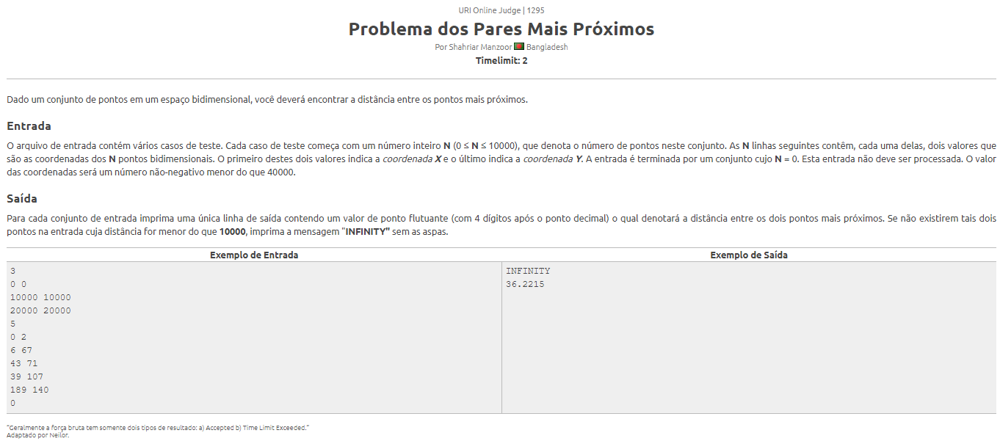
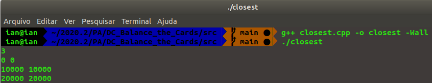
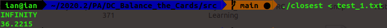

# Closest Pair

**Número da Lista**: 13<br>
**Conteúdo da Disciplina**: Divide and Conquer<br>

## Alunos
|Matrícula | Aluno |
| -- | -- |
| 16/0124778  |  Ian Pereira de Sousa Rocha |
| 15/0135521  |  Leonardo da Silva Santos Barreiros |

## Sobre
<p align="justify">O programa Closest Pair é feito para solucionar um problema do URI usando algoritmos que correspondam com a metodologia de Dividir e Conquistar.
O problema consiste em um dado conjunto de pontos em um espaço bidimensional, encontrar a distância entre os pontos mais próximos.

## Screenshots




## Instalação
**Linguagem**: C++<br>

É necessário que tenha instalado o __g++__ para executar o programa.

## Uso
Para a execução do projeto digite no seu terminal:
```
g++ closest.cpp -o <nome do compilado> -Wall
```
Quando o programa abrir basta inserir os casos de teste que estão presentes no arquivo __test_1.txt__ ou conforme desejado pelo usuário.

Ao final da execução ele irá printar no terminal os resultados conforme as instruções do script.

## Vídeo
[](https://youtu.be/givEnAOBKu0)